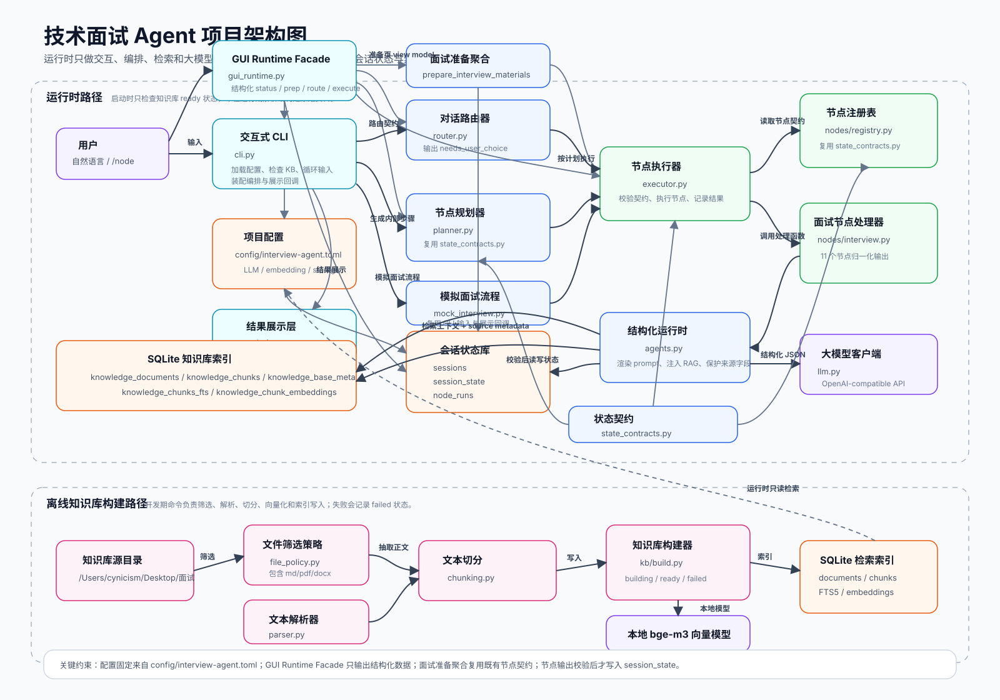
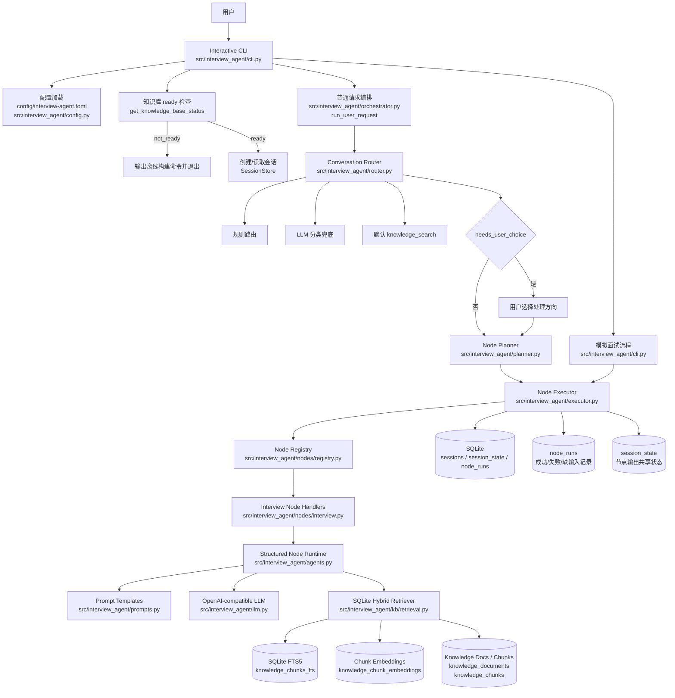
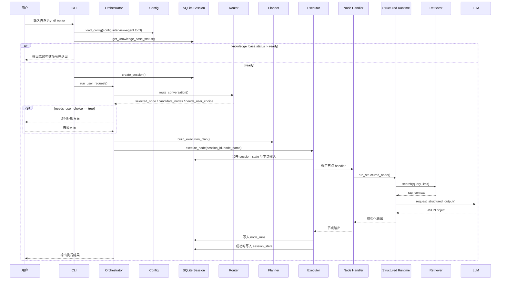
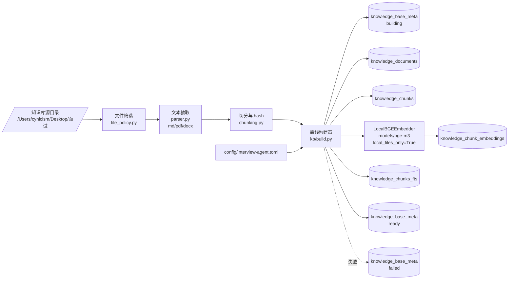
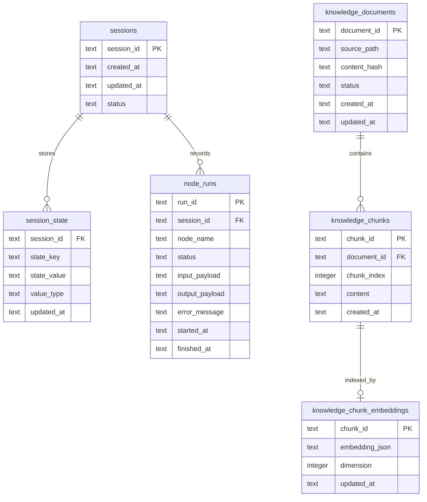

# 项目架构图

本文档描述当前项目的已实现架构。图中模块均对应仓库中的文档或代码。

## 维护规则

- 项目架构有变动时，必须同步更新 `docs/architecture.svg`。
- 架构说明有变动时，必须同步更新本文档。
- 涉及运行时入口、节点编排、节点契约、存储结构、知识库构建、检索链路、配置边界或外部服务调用的变更，均属于架构变动。

## 总览架构

## 运行时调用链

## 离线知识库构建

## 数据边界

## 架构约束

- 入口是交互式 CLI，不是固定流水线。
- CLI 的普通请求路径委派给 `run_user_request()`；模拟面试流程仍保留在 CLI 模块内。
- 配置固定读取 `config/interview-agent.toml`。
- 运行时只检查知识库 ready 状态，不构建知识库。
- 知识库通过离线命令构建到 SQLite。
- 节点之间只通过 SQLite `session_state` 共享数据。
- 节点执行结果统一记录到 `node_runs`。
- 路由明确时直接执行内部步骤。
- Router 通过 `needs_user_choice` 显式告诉 CLI 是否询问用户。
- CLI 只展示能力方向，不展示 `candidate_nodes` 内部节点名。
- Planner 只生成内部执行步骤，`requires_confirmation` 保留为兼容字段且固定为 `False`。
- 知识库检索使用 SQLite FTS5 和本地 bge-m3 embedding 混合排序。
