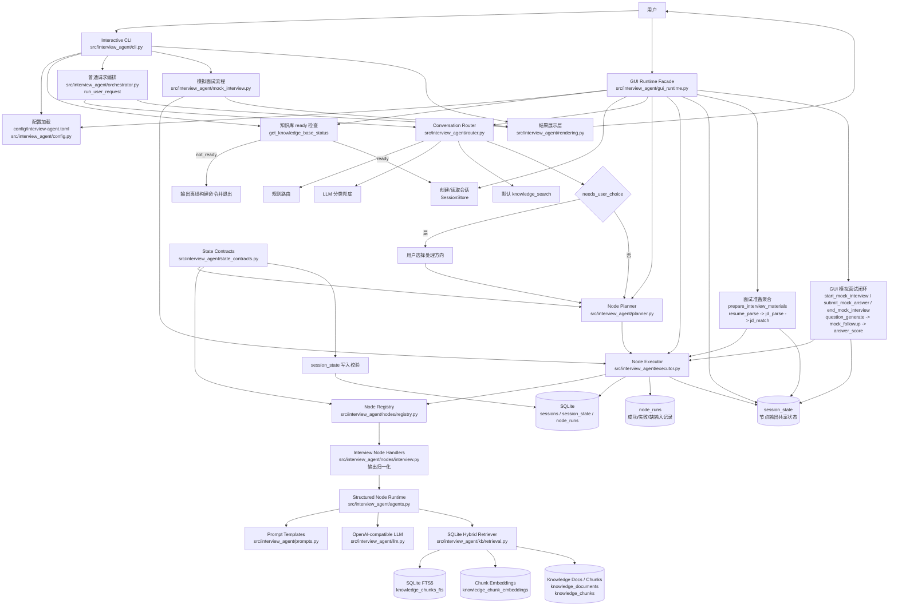
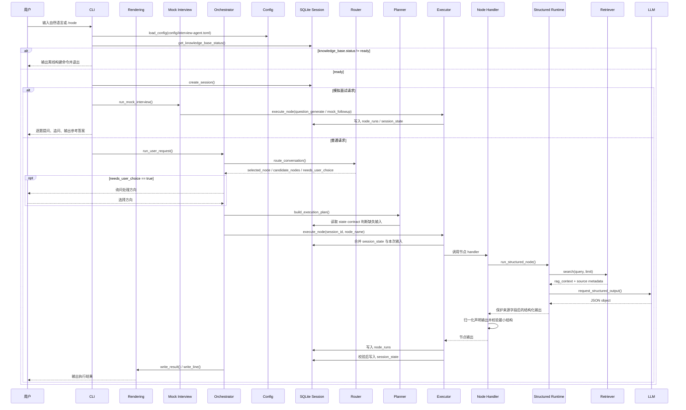
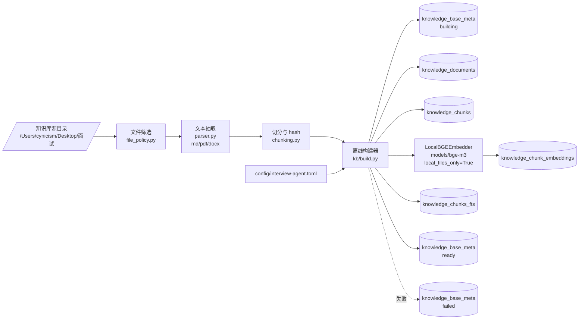
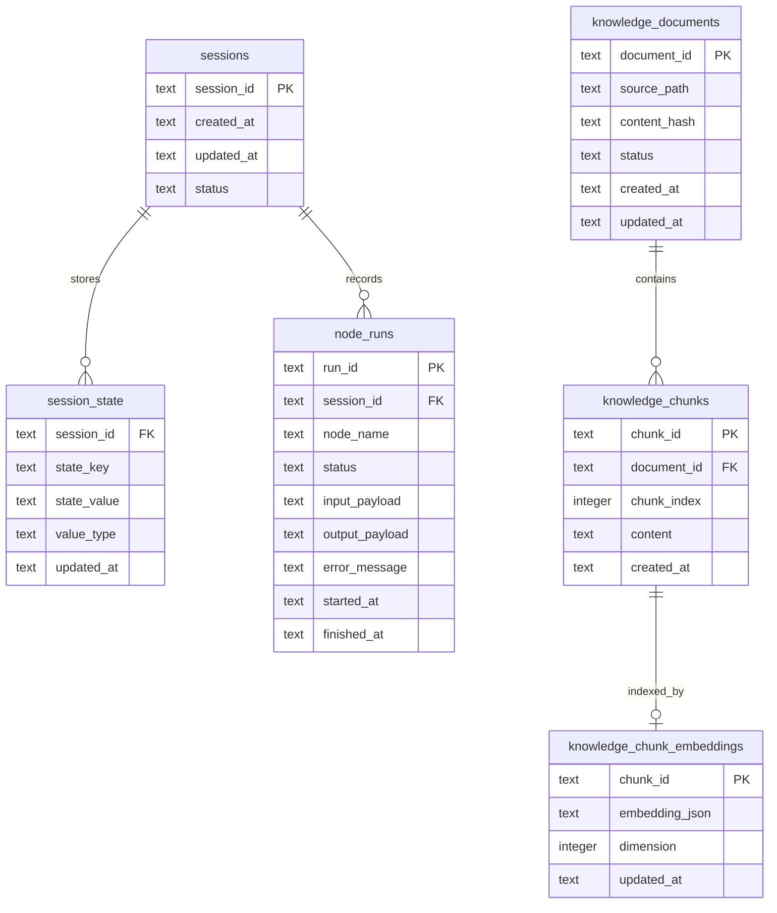

# 项目架构图

本文档描述当前项目的已实现架构。图中模块均对应仓库中的文档或代码。

## 维护规则

- 项目架构有变动时，必须同步更新 `docs/architecture.svg`。
- 架构说明有变动时，必须同步更新本文档。
- 涉及运行时入口、节点编排、节点契约、存储结构、知识库构建、检索链路、配置边界或外部服务调用的变更，均属于架构变动。

## 总览架构

## 运行时调用链

## 离线知识库构建

## 数据边界

## 架构约束

- 入口是交互式 CLI，不是固定流水线。
- CLI 的普通请求路径委派给 `run_user_request()`；模拟面试专属流程委派给 `mock_interview.py`，并复用 CLI 提供的补输入、结果展示和取消异常回调。
- 用户可见结果展示集中在 `rendering.py`；`cli.py` 仅保留 `_write_result()`、`_write_line()` 等兼容包装和回调装配。
- GUI Runtime Facade 的面试准备入口通过 `prepare_interview_materials()` 串联 `resume_parse`、`jd_parse`、`jd_match`，返回简历摘要、岗位重点、匹配度、优势、风险和追问重点。
- GUI Runtime Facade 的模拟面试入口通过 `start_mock_interview()`、`submit_mock_answer()`、`end_mock_interview()` 复用 `question_generate`、`mock_followup`、`answer_score`，并把当前题、追问、评分和终态 view model 写入 SQLite `session_state`。
- 配置固定读取 `config/interview-agent.toml`。
- 运行时只检查知识库 ready 状态，不构建知识库。
- 知识库通过离线命令构建到 SQLite。
- 节点之间只通过 SQLite `session_state` 共享数据。
- 节点输入、可选输入和输出 key 由 `state_contracts.py` 集中定义。
- Planner 和 Registry 复用同一份 state contract。
- `session_state` 写入只做轻量结构校验，不强制业务 schema；`search_results = []` 是合法空检索结果。
- 节点执行结果统一记录到 `node_runs`。
- 路由明确时直接执行内部步骤。
- Router 通过 `needs_user_choice` 显式告诉 CLI 是否询问用户。
- CLI 只展示能力方向，不展示 `candidate_nodes` 内部节点名。
- Planner 只生成内部执行步骤，`requires_confirmation` 保留为兼容字段且固定为 `False`。
- 知识库检索使用 SQLite FTS5 和本地 bge-m3 embedding 混合排序。
- CLI 将 `config.knowledge_base.top_k` 装配为检索默认 limit；节点显式 `top_k` 输入优先。
- `knowledge_search` 的 `search_results` 以 retriever chunk 为来源基底，`chunk_id`、`source_path`、`score`、`content` 不由 LLM 覆盖。
- 空检索结果仍只写入契约字段 `search_results = []`；用户可读提示留在 CLI 展示层，不进入 `session_state`。
